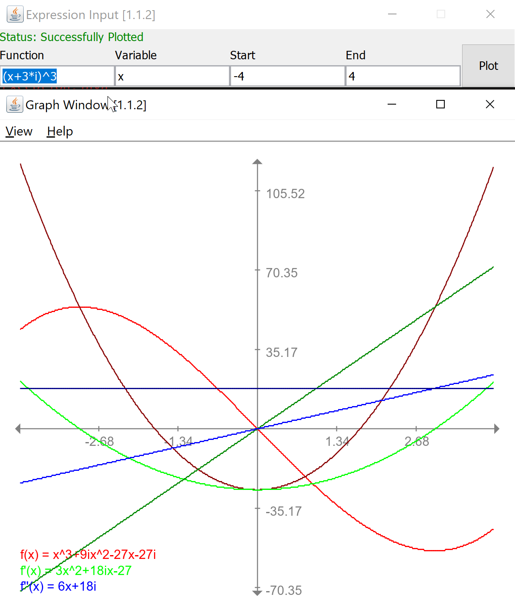

# Polynomial Graphing Calculator

A graphing calculator project which was designed as part of a university 
assignment.

This project was implemented during second-year University. The design
of this does not necessarily reflect the quality of decisions that 
would be made if this were to be done again from scratch.

_**This project is no longer maintained**_

## Features

- [x] Single-variable polynomials with arbitrary coefficients
- [x] Polynomials containing imaginary/complex numbers
- [x] Polynomials containing rational numbers
- [x] Reducing rational/complex numbers, and polynomials to lowest terms
- [x] Graphing polynomial output, along with first and second order derivations



## How to build 

From terminal, invoke:
```bash
./gradlew build
```
for posix, or 
```bash
gradlew.bat build
```
from windows 

The resulting binary will be in `build/libs/Graphing-Calculator-<version>.jar`

## How to run

Same as any java jar, just run `java -jar <jarname>`, e.g.:
```sh
java -jar build/libs/Graphing-Calculator-<version>.jar
```

## License


The class is licensed under the [MIT License](http://opensource.org/licenses/MIT):

Copyright &copy; 2016 Matthew Rodusek

Permission is hereby granted, free of charge, to any person obtaining a copy
of this software and associated documentation files (the "Software"), to deal
in the Software without restriction, including without limitation the rights
to use, copy, modify, merge, publish, distribute, sublicense, and/or sell
copies of the Software, and to permit persons to whom the Software is
furnished to do so, subject to the following conditions:

The above copyright notice and this permission notice shall be included in all
copies or substantial portions of the Software.

THE SOFTWARE IS PROVIDED "AS IS", WITHOUT WARRANTY OF ANY KIND, EXPRESS OR
IMPLIED, INCLUDING BUT NOT LIMITED TO THE WARRANTIES OF MERCHANTABILITY,
FITNESS FOR A PARTICULAR PURPOSE AND NONINFRINGEMENT. IN NO EVENT SHALL THE
AUTHORS OR COPYRIGHT HOLDERS BE LIABLE FOR ANY CLAIM, DAMAGES OR OTHER
LIABILITY, WHETHER IN AN ACTION OF CONTRACT, TORT OR OTHERWISE, ARISING FROM,
OUT OF OR IN CONNECTION WITH THE SOFTWARE OR THE USE OR OTHER DEALINGS IN THE
SOFTWARE.
